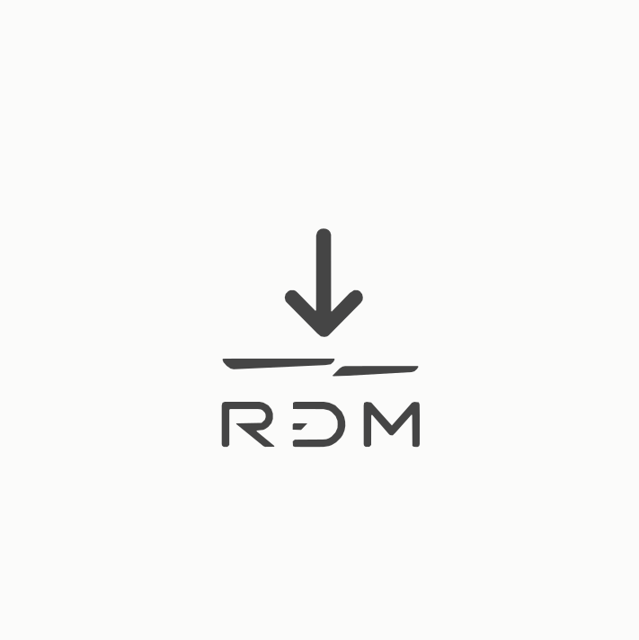

# RDM Super

### 时间，由你定义的下载引擎

高速多协议下载 · 视频随心下 · 模型一键落位

`Windows 10 / 11` · `免费` · `无广告` · `应用内自动更新`

---

## ⬇️ 获取 RDM Super

前往 [**Releases**](https://github.com/roivy/rdm-super-release/releases/latest) 页面：

| 文件 | 说明 |
|---|---|
| `RDM-Super-Setup-x.y.z.exe` | **安装包（推荐）**——多线程引擎、视频引擎、合成与解压能力全部内置 |
| `BrowserExtension.zip` | 浏览器伴侣（可选）——网页里的视频与媒体一键送到 RDM |

首次运行有四步引导；老版本用户打开应用即可收到自动更新——**主界面直接下载、进度条实时走、装完自动重启**，全程零操作。

## ✨ 它能做什么

**🎬 视频，随心下**
粘贴 YouTube / B 站 / 抖音 / X 等平台链接，自动进入视频模式：清晰度自选、字幕嵌入、整单播放列表、到点定时开录。

**🧲 多协议，一个入口**
HTTP 多线程分段 · 断点续传 · FTP / SFTP · WebDAV · 磁力 / BT · HLS / DASH 流媒体 · HuggingFace / 魔搭整仓 · GitHub 仓库目录 · 迅雷 / 快车 / QQ 旋风专用链。

**🤖 模型，一键落位**
下载即安装：自动识别 LM Studio / Ollama / ComfyUI（含自定义安装位置），大模型直接落进正确目录，LFS 文件逐个 sha256 校验，镜像加速自动择优。

**⏱ 定时下载**
「稍后下载」选好时间——1 小时后、明早九点、或任意时刻。任务安静躺在列表里标注「定时 21:00」，到点自动开跑，重启也不丢计划。

**🧊 更多内置**
任务级限速与全局限速 · 智能调度（电池 / 计费网络自动让路） · 文件校验自动比对 · 完成动作 · aria2 JSON-RPC 兼容 · HTTP API 与 MCP 智能体接口 · 深色模式 · 中英双语。

## ❓ 常见问题

**双击安装包出现蓝色提示？**
新版应用尚未积累足够信誉，选择「更多信息 → 仍要运行」即可。安装包与更新清单全程 SHA-256 + Ed25519 双重校验。

**怎么升级？**
打开应用，8 秒内自动检查更新；点一下「立即更新」，主界面横幅直接显示下载进度，完成后自动安装并重启，任务列表原样保留。

**浏览器伴侣怎么装？**
解压 `BrowserExtension.zip`，按应用内「设置 → 浏览器集成」的四步指引加载即可；不装扩展不影响主程序使用。

---

**RDM Super** · © 2026 Roivy Mao · All Rights Reserved

